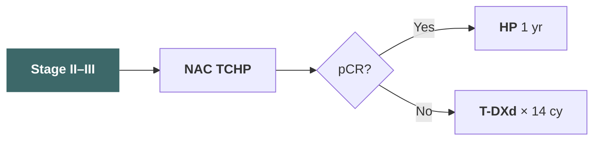
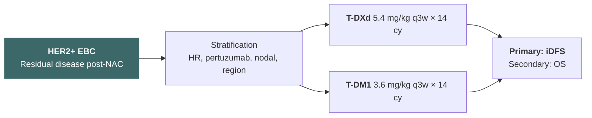
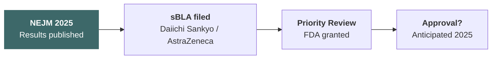
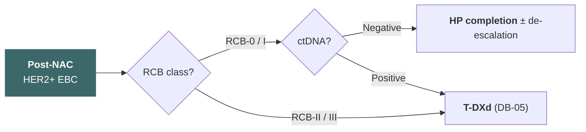
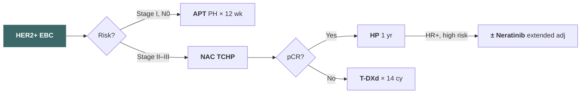

# Adjuvant Therapy for HER2-Positive Breast Cancer: From Standard to Precision

An Evolving Landscape — 2026 Update

<!--
這張投影片要強調：這是一個關於 HER2 陽性乳癌輔助治療的全面回顧，涵蓋從 trastuzumab 到 T-DXd 等新藥的最新進展。提示下一頁：我們先從 HER2 陽性乳癌的基礎開始。
-->

---

# Introduction

<!--
這張投影片要強調：接下來進入介紹部分，了解 HER2 陽性乳癌的基本特徵和治療架構。提示下一頁：先看 HER2 陽性乳癌的概述。
-->

---

## HER2-Positive Breast Cancer Overview

- **HER2+ breast cancer**: ~15–20% of all breast cancers; defined by IHC 3+ or FISH-amplified
- Historically aggressive subtype with poor prognosis before anti-HER2 therapy
- **HER2-targeted agents** have transformed outcomes — 10-year OS now exceeds 80% in early-stage disease
- Key drug classes: monoclonal antibodies (trastuzumab, pertuzumab), ADCs (T-DM1, T-DXd), TKIs (tucatinib, neratinib)
- Treatment decisions guided by **stage at presentation** and **response to neoadjuvant therapy**

> The advent of anti-HER2 therapy has converted one of the most aggressive breast cancer subtypes into one with among the best prognoses — but residual disease and high-risk features remain challenges.

<cite>Slamon DJ et al. NEJM 2001; Swain SM et al. NEJM 2015</cite>

<!--
這張投影片要強調：HER2 陽性乳癌佔所有乳癌的 15-20%，在 anti-HER2 治療出現前預後很差，但如今 10 年存活率已超過 80%。治療決策取決於分期和對前導性治療的反應。提示下一頁：目前的治療演算法。
-->

---

## Treatment Algorithm for Early HER2+ Breast Cancer

**Low Risk (Stage I, ≤2 cm, N0)**

**Higher Risk (Stage II–III)**

<cite>NCCN Guidelines Breast Cancer v2.2025</cite>

<!--
這張投影片要強調：早期 HER2 陽性乳癌的治療策略依風險分層——低風險用 APT，較高風險先做 TCHP 再依 pCR 與否決定後續治療。提示下一頁：進入標準輔助治療架構。
-->

---

# Standard Adjuvant Framework

<!--
這張投影片要強調：接下來回顧 HER2 陽性乳癌輔助治療的標準架構，從 trastuzumab 的里程碑開始。提示下一頁：先談 trastuzumab 的基礎地位。
-->

---

## Trastuzumab — The Foundation

- **HERA, NSABP B-31, NCCTG N9831** (2005): adjuvant trastuzumab reduced recurrence by ~50%
- 1 year of trastuzumab became global standard of care
- 10-year DFS improvement: **HR 0.76** (HERA), absolute benefit ~6–8%
- Cardiac toxicity (CHF ~2–4%) requires monitoring
- Shorter durations (6 months) tested but **not non-inferior** to 12 months (PHARE, PERSEPHONE debated)

> Trastuzumab established the proof of concept for HER2-targeted adjuvant therapy and remains the backbone of all regimens.

<cite>Piccart-Gebhart MJ et al. NEJM 2005; Romond EH et al. NEJM 2005</cite>

<!--
這張投影片要強調：Trastuzumab 是 HER2 陽性乳癌輔助治療的基石，2005 年的臨床試驗顯示可降低約 50% 的復發風險。1 年治療是全球標準。提示下一頁：加上 pertuzumab 的雙標靶策略。
-->

---

## APHINITY — Adding Pertuzumab

- **Phase III**: pertuzumab + trastuzumab + chemo vs trastuzumab + chemo
- **N = 4,805**; node-positive and high-risk node-negative
- **8.4-yr iDFS**: HR 0.77 (95% CI 0.66–0.91)
- Node-positive subgroup: **absolute iDFS benefit ~4.9%** at 6 yr
- Node-negative: minimal benefit

### Key Takeaways

<!-- prettier-ignore -->
| | Pertuzumab + H | H alone |
|---|---|---|
| 8-yr iDFS (N+) | 87.9% | 83.0% |
| 8-yr iDFS (N−) | 92.8% | 92.5% |
| Diarrhea G3+ | 9.8% | 3.7% |
| Cardiac events | Similar | — |

> Pertuzumab addition benefits primarily node-positive patients; its value in node-negative disease is limited.

<cite>von Minckwitz G et al. NEJM 2017; Piccart M et al. Lancet Oncol 2024</cite>

<!--
這張投影片要強調：APHINITY 試驗證實 pertuzumab 加入 trastuzumab 在淋巴結陽性患者有約 4.9% 的絕對 iDFS 獲益，但在淋巴結陰性患者幾乎沒有額外好處。提示下一頁：低風險族群的去強化策略。
-->

---

## APT Trial — De-escalation for Small Tumors

- **Single-arm phase II** (Tolaney et al.): paclitaxel weekly × 12 + trastuzumab × 1 yr
- **N = 406**; tumors ≤3 cm, node-negative
- **7-yr iDFS: 93.3%**; 7-yr OS: 95.0%
- **No anthracycline, no pertuzumab** — excellent outcomes with less toxicity
- Recurrence rate: 2.6% distant, 0.5% locoregional at 7 yr
- Cardiac events: CHF 0.5%, LVEF decline 3.2%

> APT established that stage I HER2+ patients can achieve excellent outcomes with chemotherapy de-escalation, avoiding anthracycline toxicity.

<cite>Tolaney SM et al. JCO 2019; Tolaney SM et al. JCO 2023 (10-yr update)</cite>

<!--
這張投影片要強調：APT 試驗證實小腫瘤、淋巴結陰性的 HER2 陽性乳癌可以用去強化方案（paclitaxel + trastuzumab），7 年 iDFS 達 93%，避免了 anthracycline 的毒性。提示下一頁：KATHERINE 試驗改變了殘留疾病的處理方式。
-->

---

## KATHERINE — T-DM1 for Residual Disease

- **Phase III**: T-DM1 vs trastuzumab in non-pCR patients
- **N = 1,486**; **7-yr iDFS**: 80.8% vs 67.1% — **HR 0.54**
- **Absolute benefit: 13.7%** at 7 yr
- **7-yr OS**: 89.1% vs 84.4%

### Subgroup Highlights

- HR+ (HR 0.53) and HR− (HR 0.56): consistent benefit
- **CNS recurrence**: reduced (5.9% vs 8.9%)

> KATHERINE established T-DM1 as standard for non-pCR patients — the first response-adapted strategy in HER2+ breast cancer.

<cite>von Minckwitz G et al. NEJM 2019; Loibl S et al. JCO 2024 (7-yr update)</cite>

<!--
這張投影片要強調：KATHERINE 是第一個根據前導性治療反應來調整輔助治療的策略。non-pCR 患者換用 T-DM1 後 7 年 iDFS 改善 13.7%，成為標準治療。提示下一頁：進入 DESTINY-Breast05。
-->

---

# DESTINY-Breast05

<!--
這張投影片要強調：DESTINY-Breast05 是近年來 HER2 陽性乳癌輔助治療最重要的突破性試驗。提示下一頁：先看試驗設計。
-->

---

## DESTINY-Breast05 — Trial Design

- **Phase III, randomized, open-label**
- **N = 1,453**: HER2+ EBC with residual invasive disease post-neoadjuvant HER2-directed therapy
- **Randomization**: T-DXd (5.4 mg/kg q3w × 14 cycles) vs T-DM1 (3.6 mg/kg q3w × 14 cycles)
- Stratification: HR status, prior pertuzumab, nodal status at surgery, region
- **Primary endpoint**: iDFS
- Key secondary: OS, iDFS in HR+/HR− subgroups, safety
- Follow-up required for ASCT and CNS endpoints

> Head-to-head comparison of two ADCs in the post-neoadjuvant residual disease setting — the first trial to directly challenge KATHERINE's standard.

<cite>Curigliano G et al. NEJM 2025</cite>

<!--
這張投影片要強調：DB-05 是第一個在 KATHERINE 建立的 non-pCR 標準上直接挑戰 T-DM1 的隨機 phase III 試驗，納入 1,453 位有殘留疾病的患者。提示下一頁：試驗設計圖。
-->

---

## DESTINY-Breast05 — Trial Schema

<cite>Curigliano G et al. NEJM 2025</cite>

<!--
這張投影片要強調：DB-05 的試驗設計圖——殘留疾病患者經分層後隨機分配到 T-DXd 或 T-DM1，主要終點為 iDFS。提示下一頁：關鍵結果。
-->

---

## DESTINY-Breast05 — Key Efficacy Results

### Primary Endpoint: iDFS

- **T-DXd**: 3-yr iDFS **90.6%**
- **T-DM1**: 3-yr iDFS **80.3%**
- **HR 0.47** (95% CI 0.35–0.63; p < 0.001)
- **Absolute benefit: 10.3%** at 3 yr
- Events: T-DXd 54/732 vs T-DM1 106/721

### Recurrence Patterns

<!-- prettier-ignore -->
| Event Type | T-DXd | T-DM1 |
|---|---|---|
| Distant recurrence | 5.3% | 12.1% |
| Locoregional | 1.0% | 1.9% |
| CNS as first event | 1.5% | 3.5% |
| Contralateral BC | 0.4% | 0.7% |
| Death without recurrence | 0.3% | 0.6% |

> T-DXd reduced the risk of iDFS events by 53% compared to T-DM1 — the largest improvement seen in adjuvant HER2+ trials since trastuzumab itself.

<cite>Curigliano G et al. NEJM 2025</cite>

<!--
這張投影片要強調：DB-05 的核心結果——T-DXd 相較於 T-DM1，3 年 iDFS 從 80.3% 提升到 90.6%，HR 0.47，絕對獲益超過 10%。遠端復發從 12.1% 降到 5.3%，CNS 復發也明顯減少。提示下一頁：亞族群分析。
-->

---

## DESTINY-Breast05 — Subgroup Analysis

### Consistent Benefit Across Subgroups

- **HR-positive**: HR 0.47 (0.32–0.69)
- **HR-negative**: HR 0.48 (0.30–0.78)
- **Prior pertuzumab**: HR 0.50 (0.36–0.70)
- **No prior pertuzumab**: HR 0.37 (0.20–0.68)
- **ypN0 (node-negative at surgery)**: HR 0.43
- **ypN+ (node-positive at surgery)**: HR 0.49

### Notable Observations

- Benefit seen regardless of HR status
- Patients who had received pertuzumab still benefited
- Residual nodal disease — a poor prognostic group — showed robust benefit
- No subgroup showed a signal favoring T-DM1
- OS data immature but trending favorably

> T-DXd superiority was consistent across all pre-specified subgroups — no identifiable population that should preferentially receive T-DM1.

<cite>Curigliano G et al. NEJM 2025</cite>

<!--
這張投影片要強調：亞族群分析顯示 T-DXd 的獲益在所有預設的亞族群中一致，包括 HR 陽性/陰性、有無使用過 pertuzumab、殘留淋巴結狀態。沒有任何亞族群顯示 T-DM1 較優。提示下一頁：安全性。
-->

---

## DESTINY-Breast05 — Safety Profile

<!-- prettier-ignore -->
| AE | T-DXd | T-DM1 |
|---|---|---|
| Nausea (any grade) | 73% | 41% |
| Alopecia | 36% | 5% |
| Fatigue | 41% | 30% |
| Neutropenia G3+ | 11% | 3% |
| Thrombocytopenia G3+ | 3% | 8% |
| **ILD/pneumonitis** (any) | **12.4%** | 1.7% |
| ILD/pneumonitis G3+ | 0.7% | 0.3% |
| Treatment discontinuation | 17% | 10% |

> T-DXd has a distinct toxicity profile vs T-DM1 — more nausea and ILD risk, less thrombocytopenia.

<cite>Curigliano G et al. NEJM 2025</cite>

<!--
這張投影片要強調：T-DXd 的安全性特徵與 T-DM1 不同——更多噁心、脫髮和嗜中性球低下，但血小板低下較少。ILD 是最需要關注的不良反應。提示下一頁：ILD 的詳細討論。
-->

---

## DESTINY-Breast05 — Interstitial Lung Disease (ILD)

- **ILD/pneumonitis**: the key safety concern with T-DXd
- **12.4%** any-grade (mostly G1–G2)
- **No G5 (fatal) ILD events** in DB-05
- Median onset: ~5 months
- Most resolved with corticosteroids and drug hold/discontinuation
- Requires **proactive monitoring**: CT imaging, pulmonary function
- **Management**: early detection, prompt steroid initiation, dose interruption/discontinuation
- Treatment discontinuation due to ILD: ~5%

> ILD is manageable in the adjuvant setting with proactive monitoring — no fatal events in DB-05, but vigilance is essential.

<cite>Curigliano G et al. NEJM 2025</cite>

<!--
這張投影片要強調：ILD 發生率 12.4% 但多為 G1-G2，DB-05 中沒有致死性 ILD。中位發生時間約 5 個月，大多數以類固醇和停藥處理後可改善。在輔助治療中需要積極監測但可控。提示下一頁：FDA 狀態。
-->

---

## DESTINY-Breast05 — FDA Status & Clinical Impact

- **FDA Priority Review** granted; anticipated approval in 2025
- If approved: T-DXd replaces T-DM1 as standard for **non-pCR after neoadjuvant therapy**
- **Key practice changes**:
  - New standard for post-neoadjuvant residual disease
  - ILD monitoring protocols needed in adjuvant clinics
  - Anti-emetic prophylaxis (moderate emetogenic potential)
  - Patient education about ILD symptoms

> DB-05 represents the most impactful change in adjuvant HER2+ breast cancer management since KATHERINE — T-DXd is poised to become the new standard.

<cite>Curigliano G et al. NEJM 2025</cite>

<!--
這張投影片要強調：DB-05 獲得 FDA 優先審查，預計 T-DXd 將取代 T-DM1 成為 non-pCR 患者的新標準。臨床實務需要建立 ILD 監測和止吐方案。提示下一頁：FDA 時間軸。
-->

---

## DESTINY-Breast05 — Regulatory Timeline

<cite>Curigliano G et al. NEJM 2025</cite>

<!--
這張投影片要強調：DB-05 從發表到 FDA 優先審查的時間軸，預計 2025 年獲批。提示下一頁：待解的問題。
-->

---

## DESTINY-Breast05 — Open Questions

- Long-term **OS benefit**?
- Optimal management of **T-DXd–related ILD** in curative setting?
- Can T-DXd replace T-DM1 + additional agents in **ultra-high-risk** patients?
- **Sequencing** with other HER2 agents after T-DXd exposure?

> These unresolved questions will shape the next generation of adjuvant HER2+ trials.

<cite>Curigliano G et al. NEJM 2025</cite>

<!--
這張投影片要強調：DB-05 仍有幾個關鍵待解問題——長期 OS、ILD 管理、超高風險患者的策略、以及 T-DXd 之後的治療序列。提示下一頁：進入 DESTINY-Breast11。
-->

---

# Tucatinib & TKIs

<!--
這張投影片要強調：小分子 TKI 為 HER2 陽性乳癌的輔助治療提供了另一個維度，特別是針對高風險族群和 CNS 轉移預防。提示下一頁：CompassHER2 試驗。
-->

---

## CompassHER2 — Trial Design

- **Phase III, randomized, double-blind**
- Tucatinib + T-DM1 vs placebo + T-DM1
- **Population**: HER2+ EBC, residual disease post-neoadjuvant
- Patients completing KATHERINE-like T-DM1 backbone
- **Primary endpoint**: iDFS
- Tucatinib: oral HER2-selective TKI, **CNS-penetrant**
- Rationale: add TKI on top of T-DM1 for ultra-high-risk patients

> CompassHER2 tested whether a CNS-penetrant TKI could further improve outcomes when added to the KATHERINE backbone.

<cite>Tolaney SM et al. ASCO 2025</cite>

<!--
這張投影片要強調：CompassHER2 的設計是在 KATHERINE 的 T-DM1 骨架上加入 tucatinib，針對殘留疾病的高風險患者。Tucatinib 是具有 CNS 穿透性的 HER2 選擇性 TKI。提示下一頁：CompassHER2 結果。
-->

---

## CompassHER2 — Results

- Study **closed early** due to futility at pre-planned interim analysis
- **No significant iDFS benefit** with tucatinib + T-DM1 vs T-DM1 alone
- Possible explanations:
  - T-DM1 backbone may have a **ceiling effect**
  - Patient population may differ from metastatic setting
  - Tucatinib tolerability in adjuvant setting
- Ongoing debate on combination strategies in early-stage disease

> CompassHER2 showed that adding tucatinib to T-DM1 did not improve iDFS — metastatic efficacy does not always translate to adjuvant benefit.

<cite>Tolaney SM et al. ASCO 2025</cite>

<!--
這張投影片要強調：CompassHER2 因無效在期中分析時提前終止。Tucatinib 加入 T-DM1 未能改善 iDFS。這提醒我們轉移性治療的成功不一定能直接複製到輔助治療。提示下一頁：HER2CLIMB-05。
-->

---

## HER2CLIMB-05 — Trial Design

- **Phase III, randomized**
- Tucatinib + trastuzumab + capecitabine vs trastuzumab + capecitabine
- **Population**: HER2+ MBC with brain metastases (prior ≥1 HER2-directed therapy)
- Based on HER2CLIMB platform
- **Primary endpoint**: PFS
- Key secondary: OS, CNS-PFS, CNS-ORR

> HER2CLIMB-05 tested whether adding a CNS-penetrant TKI could improve outcomes in patients with HER2+ MBC and brain metastases.

<cite>Murthy R et al. Lancet Oncol 2025</cite>

<!--
這張投影片要強調：HER2CLIMB-05 是基於 HER2CLIMB 平台的 phase III 試驗，測試 tucatinib 加入 trastuzumab + capecitabine 對有腦轉移的 HER2 陽性轉移性乳癌患者的療效。提示下一頁：HER2CLIMB-05 結果。
-->

---

## HER2CLIMB-05 — Key Results

### Efficacy

- **Median PFS**: **24.9 vs 16.3 mo** (HR 0.60; 95% CI 0.44–0.83)
- **CNS-PFS**: significantly improved
- **OS**: favorable trend

### CNS Activity

<!-- prettier-ignore -->
| Endpoint | Tucatinib arm | Control |
|---|---|---|
| CNS-ORR (active brain mets) | 47% | 20% |
| CNS-PFS | HR 0.44 | — |
| 1-yr CNS-PFS | 63% | 33% |

> HER2CLIMB-05 confirmed tucatinib's robust CNS activity — raising the question of whether TKIs could prevent brain metastases in the adjuvant setting.

<cite>Murthy R et al. Lancet Oncol 2025</cite>

<!--
這張投影片要強調：HER2CLIMB-05 中 tucatinib 組合方案的中位 PFS 為 24.9 vs 16.3 個月，CNS 反應率明顯較高。這引發了 TKI 在輔助治療中預防腦轉移的可能性。提示下一頁：TKI 在 HER2 陽性乳癌中的整體定位。
-->

---

## TKI Landscape — Trial Summary

| Agent         | Setting                 | Key Trial   | Key Finding                    |
| ------------- | ----------------------- | ----------- | ------------------------------ |
| **Tucatinib** | Metastatic + brain mets | HER2CLIMB   | PFS benefit, CNS activity      |
| **Tucatinib** | Adjuvant (+ T-DM1)      | CompassHER2 | No iDFS benefit (closed early) |
| **Neratinib** | Extended adjuvant       | ExteNET     | iDFS benefit in HR+, prior H   |
| **Lapatinib** | Adjuvant                | ALTTO       | No benefit over H alone        |
| **Pyrotinib** | Neoadjuvant             | PHEDRA      | Higher pCR with pyrotinib + H  |

> Mixed results across settings — metastatic and CNS activity are strong, but adjuvant benefit remains elusive for most TKIs.

<cite>Murthy RK et al. NEJM 2020; Baselga J et al. Lancet 2012; Martin M et al. Lancet Oncol 2017</cite>

<!--
這張投影片要強調：TKI 在 HER2 陽性乳癌中各個試驗的結果總覽——轉移性和 CNS 活性很好，但輔助治療的結果有喜有憂。提示下一頁：TKI 的整體定位與未來方向。
-->

---

## TKI Landscape — Key Takeaways

- **TKIs in adjuvant setting**: mixed results — not a universal add-on
- Best evidence: **neratinib** in extended adjuvant (HR+, delayed start)
- **CNS-penetrant TKIs** may have niche role for brain metastasis prevention
- Future: **biomarker-selected populations** for TKI intensification?

> TKIs remain most impactful in the metastatic and CNS-active settings; their adjuvant role requires more precise patient selection.

<cite>Murthy RK et al. NEJM 2020; Martin M et al. Lancet Oncol 2017</cite>

<!--
這張投影片要強調：TKI 目前在輔助治療中尚無廣泛適用的角色，最有價值的方向是 CNS 穿透性和生物標記選擇的族群。需要更精準的患者選擇。提示下一頁：進入 Neratinib 和去強化策略。
-->

---

# Neratinib & De-escalation

<!--
這張投影片要強調：這一章討論 neratinib 在延伸輔助治療的角色以及生物標記導向的去強化策略。提示下一頁：ExteNET 試驗。
-->

---

## ExteNET — Trial Design & Results

- **Phase III**: neratinib × 1 yr vs placebo after trastuzumab-based adjuvant
- **N = 2,840**
- **8-yr iDFS**: HR 0.78 (95% CI 0.64–0.96)
- Overall absolute benefit: **3.4%** at 8 yr
- **HR-positive**: iDFS HR 0.60 — **7.4% absolute benefit**
- **HR-negative**: no significant benefit
- **≤1 yr from trastuzumab**: greater benefit
- **>1 yr from trastuzumab**: diminished benefit

> ExteNET showed that extended adjuvant neratinib benefits primarily HR-positive patients who start within 1 year of completing trastuzumab.

<cite>Martin M et al. Lancet Oncol 2017; Chan A et al. JAMA Oncol 2021 (8-yr update)</cite>

<!--
這張投影片要強調：ExteNET 顯示 neratinib 延伸輔助治療在 HR 陽性亞群有 7.4% 的絕對 iDFS 獲益，但 HR 陰性無顯著獲益。開始時間越接近 trastuzumab 結束效果越好。提示下一頁：ExteNET 臨床應用。
-->

---

## ExteNET — Clinical Application

- **FDA-approved** for extended adjuvant after H-based therapy
- **Best candidates**: HR-positive, completed trastuzumab within 1 yr
- **Diarrhea management** critical:
  - G3 diarrhea ~40% without prophylaxis
  - Loperamide prophylaxis reduces to ~17%
  - Dose escalation schedule recommended
- Not widely adopted due to GI toxicity and narrow population

> Adoption has been limited by diarrhea and the availability of alternative strategies — patient selection is key.

<cite>Chan A et al. JAMA Oncol 2021</cite>

<!--
這張投影片要強調：Neratinib 已獲 FDA 核准用於延伸輔助治療，但腹瀉是主要障礙。需要 loperamide 預防和劑量遞增策略。臨床上使用範圍有限。提示下一頁：WSG-ADAPT 試驗。
-->

---

## WSG-ADAPT — Trial Design & Results

- **WSG-ADAPT HER2+/HR−**: response-guided approach
- Short induction (12 wk trastuzumab + pertuzumab ± chemo)
- **Early responders** (Ki67 drop or pCR): de-escalated chemo
- Tests whether **dual HER2 blockade alone** can substitute for full chemo
- **HER2+/HR−** cohort: HP + weekly paclitaxel × 12 wk
- pCR rate: **90.5%** in early responders
- 5-yr DFS: **98%** in pCR achievers

> WSG-ADAPT demonstrates that response-guided strategies can identify patients who achieve excellent outcomes with less intensive therapy.

<cite>Nitz U et al. JCO 2022; Harbeck N et al. Ann Oncol 2024</cite>

<!--
這張投影片要強調：WSG-ADAPT 證實反應導向的策略可以識別出哪些患者可以安全地去強化治療。早期反應者用較少的化療也能達到很高的 pCR 和 DFS。提示下一頁：去強化的原則與進行中的試驗。
-->

---

## WSG-ADAPT — De-escalation Principles

- Not all HER2+ patients need anthracyclines or taxane doublets
- **pCR as a biomarker**: patients achieving pCR with less chemo may safely de-escalate
- **Ongoing trials** testing chemo-free HER2 blockade:
  - ATEMPT 2.0: T-DM1 vs paclitaxel + HP
  - CompassHER2-pCR: de-escalation post-pCR
  - PHERGain: chemo-free HP in PET responders

> The goal is to match treatment intensity to biology — spare patients unnecessary toxicity without compromising outcomes.

<cite>Nitz U et al. JCO 2022; Harbeck N et al. Ann Oncol 2024</cite>

<!--
這張投影片要強調：去強化的核心原則是根據生物學反應調整治療強度。多個進行中的試驗正在探索無化療的 HER2 阻斷策略。提示下一頁：生物標記導向的去強化。
-->

---

## Biomarker-Guided Approaches — Current Tools

- **pCR** after neoadjuvant: strongest prognostic biomarker
- **HR status**: determines benefit from neratinib, pertuzumab
- **Residual cancer burden (RCB)**:
  - RCB-0 (pCR): excellent prognosis
  - RCB-I: near-pCR, consider de-escalation
  - RCB-II/III: high risk, intensification needed
- **ctDNA** (circulating tumor DNA): emerging for MRD detection
- **HER2DX**: genomic assay predicting pCR and survival

> Multiple biomarkers are now available — the challenge is integrating them into actionable treatment algorithms.

<cite>Symmans WF et al. JCO 2017; Prat A et al. Lancet Oncol 2023</cite>

<!--
這張投影片要強調：目前可用的生物標記包括 pCR、RCB、ctDNA 和 HER2DX，各自提供不同維度的預後資訊。提示下一頁：如何將生物標記整合到精準去強化策略。
-->

---

## Biomarker-Guided Approaches — Precision De-escalation

| Risk Level   | Biomarker Signature        | Strategy                     |
| ------------ | -------------------------- | ---------------------------- |
| Very low     | Stage I, RCB-0             | APT, consider no pertuzumab  |
| Low          | pCR after standard NAC     | HP completion, no escalation |
| Intermediate | RCB-I, ctDNA negative      | Surveillance vs maintenance  |
| High         | RCB-II/III, ctDNA positive | T-DXd (DB-05), consider TKI  |

- Future: **multi-omic integration** (genomics + ctDNA + imaging)
- Goal: match treatment intensity to individual risk

> The future of HER2+ adjuvant therapy lies in biomarker-guided precision — escalating for high-risk and de-escalating for favorable biology.

<cite>Symmans WF et al. JCO 2017; Prat A et al. Lancet Oncol 2023</cite>

<!--
這張投影片要強調：將生物標記整合到風險分層中，精準地決定誰需要更強的治療、誰可以安全地減量。未來方向是多體學整合。提示下一頁：生物標記決策樹。
-->

---

## Biomarker-Guided Decision Tree

<cite>Symmans WF et al. JCO 2017; Prat A et al. Lancet Oncol 2023</cite>

<!--
這張投影片要強調：用 RCB 和 ctDNA 建立決策樹——RCB-0/I 且 ctDNA 陰性可考慮去強化，RCB-II/III 或 ctDNA 陽性則需要 T-DXd 強化治療。提示下一頁：進入總結。
-->

---

# Summary & Q&A

<!--
這張投影片要強調：最後總結 HER2 陽性乳癌輔助治療的重要進展和未來方向。提示下一頁：關鍵要點。
-->

---

## Key Takeaways

### Established Standards

1. **Trastuzumab × 1 yr** remains the backbone
2. **Pertuzumab** adds benefit in **node-positive** disease (APHINITY)
3. **APT** enables safe de-escalation for stage I
4. **KATHERINE**: T-DM1 for non-pCR — 13.7% absolute iDFS benefit

### Practice-Changing Updates

5. **DESTINY-Breast05**: T-DXd > T-DM1 for non-pCR (HR 0.47, iDFS 90.6% vs 80.3%) — **new standard**
6. **HER2CLIMB-05**: tucatinib CNS activity (PFS 24.9 vs 16.3 mo) — implications for prevention
7. **Biomarker-guided** approaches (RCB, ctDNA, HER2DX) are reshaping risk stratification

> We are moving from a one-size-fits-all approach to precision-guided adjuvant therapy — escalating for high-risk and de-escalating for favorable-biology patients.

<cite>Curigliano G et al. NEJM 2025; von Minckwitz G et al. NEJM 2019; Tolaney SM et al. JCO 2019</cite>

<!--
這張投影片要強調：重點回顧——標準架構仍以 trastuzumab 為基礎，APHINITY 和 KATHERINE 各有其角色。DB-05 是最大突破，T-DXd 將成為 non-pCR 新標準。生物標記將引導未來的精準去強化。提示下一頁：整合治療演算法。
-->

---

## Updated Treatment Algorithm — 2025+

<cite>NCCN Guidelines v2.2025; Curigliano G et al. NEJM 2025</cite>

<!--
這張投影片要強調：整合整場演講的治療決策路徑——從分期到前導性治療、pCR 評估、到 T-DXd 新標準和 neratinib 延伸輔助。提示下一頁：感謝與 Q&A。
-->

---
layout: center
---

## Thank You & Q&A

Questions & Discussion

<!--
這張投影片要強調：感謝大家的聆聽，歡迎提問和討論。可以針對任何特定試驗或臨床情境進行深入探討。
-->
